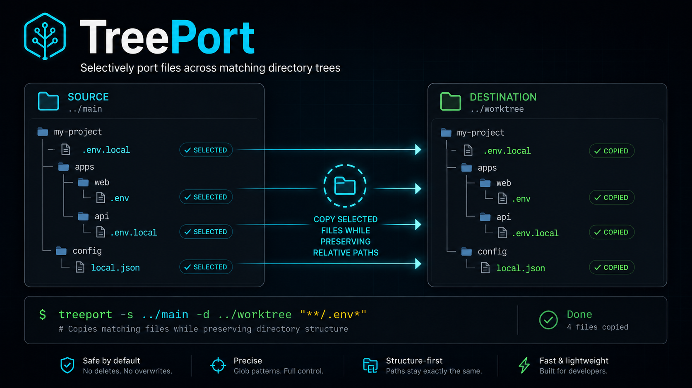
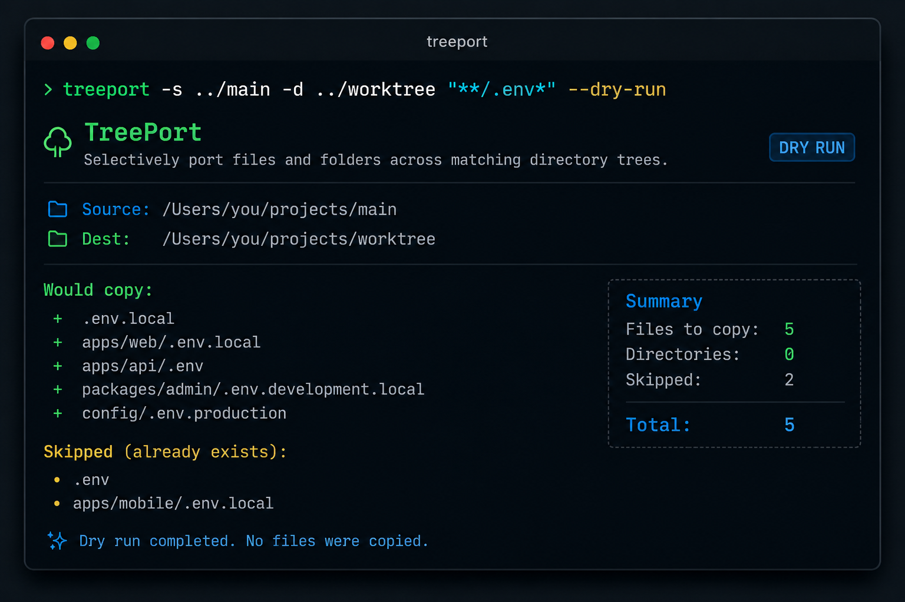

<p align="center">
  
</p>

# TreePort

Selectively port files and folders across matching directory trees.

TreePort is a small TypeScript CLI for copying only the local files you choose from one repo, worktree, clone, or project directory into another while preserving relative paths.

```bash
treeport -s ../main -d ../worktree "**/.env*"
```

That command copies matching files from `../main` into the same relative locations inside `../worktree`.

## Why

Developers often keep local-only files outside Git:

```txt
.env
.env.local
.env.production.local
config/local.json
certs/
secrets/
```

Those files are easy to forget when creating a Git worktree, cloning a repo again, or maintaining parallel project folders. TreePort copies only selected files/folders and leaves everything else alone.

## Install

Run without installing:

```bash
pnpm dlx treeport@latest -s ../main -d ../worktree "**/.env*"
```

Install globally:

```bash
pnpm add -g treeport
```

Check the CLI:

```bash
treeport --help
treeport --version
```

## Quick Start

Copy all `.env` files anywhere:

```bash
treeport -s ../main -d ../worktree "**/.env*"
```

Preview first:

```bash
treeport -s ../main -d ../worktree "**/.env*" --dry-run
```

Copy env files and a config folder:

```bash
treeport -s ../main -d ../worktree "**/.env*" "config/**"
```

Save defaults globally:

```bash
treeport config add "**/.env*"
treeport config add "config/**"
```

Use saved defaults:

```bash
treeport -s ../main -d ../worktree
```

## What It Does

TreePort:

- discovers files in the source directory using glob patterns
- applies excludes after includes
- preserves every matched file's relative path
- creates destination folders as needed, including nested subfolders that do not exist yet
- skips existing destination files by default
- overwrites only with `--overwrite`
- can create symbolic links instead of copies with `--link` or `--symlink`
- never deletes destination files
- always excludes `.git` and `node_modules`

Example:

```txt
source: ../main/apps/web/.env.local
dest:   ../worktree/apps/web/.env.local
```

## CLI

```bash
treeport -s <source-dir> -d <dest-dir> <patterns...>
```

Full form:

```bash
treeport \
  --source <source-dir> \
  --dest <dest-dir> \
  --include <pattern> \
  --exclude <pattern> \
  --dry-run \
  --overwrite \
  --link \
  --no-config \
  --verbose
```

## Flags

| Flag | Alias | Description |
| --- | --- | --- |
| `--source <dir>` | `-s` | Source directory to copy from |
| `--dest <dir>` | `-d` | Destination directory to copy into |
| `--include <pattern>` | `-i` | Include glob pattern. Can be repeated |
| `--exclude <pattern>` | `-e` | Exclude glob pattern. Can be repeated |
| `--no-config` | | Ignore global config |
| `--dry-run` | | Preview planned copies without writing files |
| `--overwrite` | | Replace existing destination files |
| `--link` | | Create symlinks instead of copying files |
| `--symlink` | | Alias for `--link` |
| `--verbose` | `-v` | Print absolute source/destination paths |
| `--help` | `-h` | Show help |
| `--version` | | Show version |

Patterns can be positional or passed with `--include`.

These are equivalent:

```bash
treeport -s ../main -d ../worktree "**/.env*"
```

```bash
treeport -s ../main -d ../worktree --include "**/.env*"
```

## Examples

Copy all env files anywhere:

```bash
treeport -s ../main -d ../worktree "**/.env*"
```

Copy only `.env.local` files anywhere:

```bash
treeport -s ../main -d ../worktree "**/.env.local"
```

Copy all `.local` env variants anywhere:

```bash
treeport -s ../main -d ../worktree "**/.env*.local"
```

Copy root env files only:

```bash
treeport -s ../main -d ../worktree ".env*"
```

Copy config files:

```bash
treeport -s ../main -d ../worktree "config/**"
```

Copy certs:

```bash
treeport -s ../main -d ../worktree "certs/**"
```

Copy env files and config:

```bash
treeport -s ../main -d ../worktree "**/.env*" "config/**"
```

Copy JSON files anywhere:

```bash
treeport -s ../main -d ../worktree "**/*.json"
```

Copy multiple extensions:

```bash
treeport -s ../main -d ../worktree "**/*.{json,yml,yaml}"
```

Exclude generated folders:

```bash
treeport -s ../main -d ../worktree "**/.env*" --exclude "**/dist/**" --exclude "**/.next/**"
```

Use a negated positional pattern as an exclude:

```bash
treeport -s ../main -d ../worktree "**/.env*" "!apps/legacy/**"
```

Dry run:

```bash
treeport -s ../main -d ../worktree "**/.env*" --dry-run
```

Overwrite existing destination files:

```bash
treeport -s ../main -d ../worktree "**/.env*" --overwrite
```

Create symlinks instead of copying files:

```bash
treeport -s ../main -d ../worktree "**/.env*" --link
```

Equivalent symlink alias:

```bash
treeport -s ../main -d ../worktree "**/.env*" --symlink
```

Ignore saved config:

```bash
treeport -s ../main -d ../worktree --no-config --include "certs/**"
```

Use absolute paths:

```bash
treeport -s /Users/you/projects/main -d /Users/you/projects/worktree "**/.env*"
```

## Dry Run

Dry run shows what would happen without copying anything.

```bash
treeport -s ../main -d ../worktree "**/.env*" --dry-run
```

<p align="center">
  
</p>

Typical dry-run output:

```txt
TreePort dry run. No files copied.

Source: ../main
Dest:   ../worktree

Would copy:
  apps/web/.env.local
  apps/api/.env

Would skip:
  .env already exists

Done. 2 would copy, 1 would skip.
```

## Pattern Guide

TreePort uses full glob syntax through `tinyglobby`.

| Pattern | Meaning |
| --- | --- |
| `.env*` | Root-level `.env`, `.env.local`, `.env.production` |
| `**/.env*` | Env files anywhere |
| `**/.env.local` | `.env.local` anywhere |
| `**/.env*.local` | `.env.local`, `.env.production.local`, etc. anywhere |
| `apps/**/.env*` | Env files inside `apps` |
| `config/**` | All files inside `config` |
| `certs/**/*` | All nested files inside `certs` |
| `*.json` | JSON files at root scan level |
| `**/*.json` | JSON files anywhere |
| `*.{json,yml,yaml}` | Multiple extensions |
| `{**/.env*,config/**}` | Grouped patterns |
| `!**/node_modules/**` | Exclude node_modules |
| `!**/.git/**` | Exclude git folder |

Important distinction:

```bash
treeport -s ../main -d ../worktree ".env*"
```

Matches root-level env files only:

```txt
.env
.env.local
.env.production
```

It does not match:

```txt
apps/web/.env
apps/api/.env.local
```

Use this for nested env files:

```bash
treeport -s ../main -d ../worktree "**/.env*"
```

## Config

TreePort supports global defaults.

Config path:

```txt
~/.config/treeport/config.json
```

Example config:

```json
{
  "includes": ["**/.env*", "config/**"],
  "excludes": ["**/node_modules/**", "**/.git/**"],
  "overwrite": false
}
```

Use config-only copying:

```bash
treeport -s ../main -d ../worktree
```

That works only when global config has at least one include pattern.

## Config Commands

Show include patterns:

```bash
treeport config list
```

Add include patterns:

```bash
treeport config add "**/.env*"
treeport config add "config/**"
```

Remove include patterns:

```bash
treeport config remove "**/.env*"
```

Clear config:

```bash
treeport config clear
```

Print config path:

```bash
treeport config path
```

Show exclude patterns:

```bash
treeport config exclude list
```

Add exclude patterns:

```bash
treeport config exclude add "**/dist/**"
treeport config exclude add "**/.next/**"
```

Remove exclude patterns:

```bash
treeport config exclude remove "**/dist/**"
```

## Config Merge Rules

By default:

```txt
final includes = global includes + CLI includes
final excludes = default excludes + global excludes + CLI excludes
```

With `--no-config`:

```txt
final includes = CLI includes only
final excludes = default excludes + CLI excludes
```

If no include patterns exist from CLI or config, TreePort exits with an error.

| Case | Behavior |
| --- | --- |
| CLI includes + config includes | Append CLI includes to config includes |
| CLI includes + `--no-config` | Use only CLI includes |
| No CLI includes + config includes | Use config includes |
| No CLI includes + no config includes | Error |
| CLI excludes + config excludes | Append CLI excludes to config excludes |
| Excludes conflict with includes | Excludes win |

Example:

```json
{
  "includes": ["**/.env*", "config/**"],
  "excludes": ["**/node_modules/**", "**/.git/**"]
}
```

Command:

```bash
treeport -s ../main -d ../worktree --include "certs/**"
```

Effective includes:

```txt
**/.env*
config/**
certs/**
```

Effective excludes:

```txt
**/.git/**
**/node_modules/**
```

## Default Excludes

TreePort always excludes:

```txt
**/.git/**
**/node_modules/**
```

Those defaults are always applied, including when `--no-config` is used.

## Destination Rules

Default behavior: existing destination files are skipped.

```bash
treeport -s ../main -d ../worktree "**/.env*"
```

Overwrite existing destination files:

```bash
treeport -s ../main -d ../worktree "**/.env*" --overwrite
```

TreePort never deletes files from the destination. It is a selective copy tool, not a sync/delete tool.

TreePort creates missing destination folders automatically.

Example:

```txt
source: ../main/apps/web/.env.local
dest:   ../worktree/apps/web/.env.local
```

If `../worktree/apps/web` does not exist, TreePort creates it before copying or linking `.env.local`.

## Symlink Mode

Use `--link` or `--symlink` when you want destination files to point back to the source tree instead of copying file contents.

```bash
treeport -s ../main -d ../worktree "**/.env*" --link
```

This creates file symlinks:

```txt
../worktree/.env.local -> ../main/.env.local
../worktree/apps/web/.env.local -> ../main/apps/web/.env.local
```

Symlink mode follows the same safety rules as copy mode:

- relative paths are preserved
- missing destination folders are created
- existing destination paths are skipped by default
- existing destination paths are replaced only with `--overwrite`
- `.git` and `node_modules` are still excluded

Overwrite existing destination paths with symlinks:

```bash
treeport -s ../main -d ../worktree "**/.env*" --link --overwrite
```

## Output

Successful copy:

```txt
TreePort

Source: ../main
Dest:   ../worktree

Copied:
  apps/web/.env.local
  apps/api/.env

Skipped:
  .env already exists

Done. 2 copied, 1 skipped.
```

No include patterns:

```txt
No include patterns found.

Pass patterns:
  treeport -s ../main -d ../worktree "**/.env*"

Or add global defaults:
  treeport config add "**/.env*"
```

No matches:

```txt
No files matched the provided patterns.

Patterns:
  **/.env.local
```

## Common Use Cases

### Git worktrees

Copy local environment files from your main checkout into a new worktree.

```bash
treeport -s ../my-app-main -d ../my-app-feature "**/.env*"
```

### Multiple local clones

Move private config from one clone to another.

```bash
treeport -s ~/code/main-app -d ~/code/main-app-debug "**/.env*" "config/local/**"
```

### Monorepos

Copy env files from every package/app.

```bash
treeport -s ../main -d ../worktree "**/.env*"
```

Copy only app env files:

```bash
treeport -s ../main -d ../worktree "apps/**/.env*"
```

### Certificates and local secrets

Copy local certificates while preserving folder layout.

```bash
treeport -s ../main -d ../worktree "certs/**" "secrets/**"
```

### Review before copying

Use dry run when handling sensitive files.

```bash
treeport -s ../main -d ../worktree "**/.env*" "secrets/**" --dry-run
```

### Repeatable defaults

Save patterns once:

```bash
treeport config add "**/.env*"
treeport config add "config/local/**"
treeport config exclude add "**/dist/**"
```

Reuse them:

```bash
treeport -s ../main -d ../worktree
```

## Safety Model

TreePort is conservative by default:

- no patterns means no copy
- destination files are skipped unless `--overwrite` is set
- missing destination folders are created, but destination files are never deleted
- symlink mode uses the same skip/overwrite rules as copy mode
- `.git` and `node_modules` are forced excludes
- no delete behavior exists
- dry-run is available for previewing sensitive operations

## Development

Install dependencies:

```bash
pnpm install
```

Typecheck:

```bash
pnpm run typecheck
```

Test:

```bash
pnpm run test
```

Build:

```bash
pnpm run build
```

Run locally after build:

```bash
node dist/index.js --help
```

## Releases

Create a changeset for every user-facing change:

```bash
pnpm changeset
```

Merging to `main` creates or updates the Changesets version PR. Merging that version PR publishes to npm from GitHub Actions through npm trusted publishing.

Trusted publishing setup:

- Publisher: GitHub Actions
- Organization/user: `d3oxy`
- Repository: `treeport`
- Workflow filename: `release.yml`
- Environment: unset
- Allowed action: `npm publish`

## License

MIT
